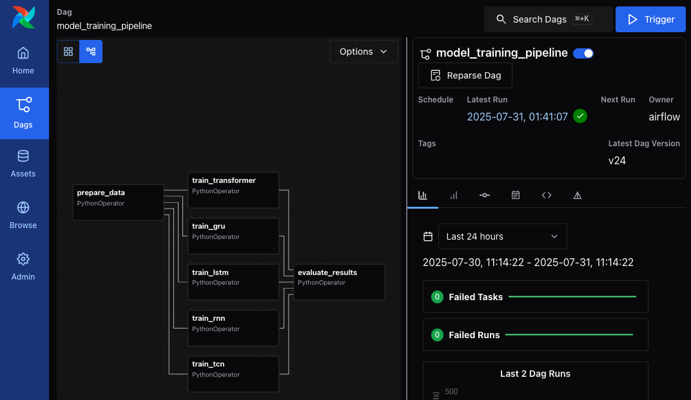
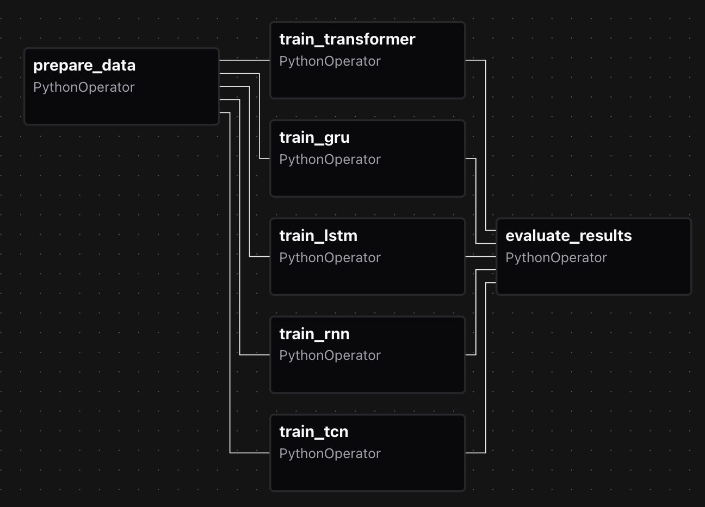

# Air Quality Index Probability Prediction (MLOps Version)

This repository is a modified version of the [original Air Quality Index (AQI) Probability Prediction project](https://github.com/PeteCastle/aqi-mdn), tailored for an activity as part of the requirements for Machine Learning Operations (MLOps) course.  Intellectual property rights for the original project are retained by the original authors: Francis Mark Cayco, Andgrel Heber Jison, Angela Elaine Pelayo, and Eros Paul Estante.

**Francis Mark Cayco**

Masters of Science in Data Science

Asian Institute of Management

## Project Overview
*How can Mixture Density Networks improve air pollution forecasting by providing uncertainty-aware predictions that support more informed and reliable business or policy decisions?*

Traditional air quality forecasting models frequently provide deterministic, single-point predictions without quantifying the associated uncertainty. This limitation can be problematic, especially when decision-making requires an understanding of the range of possible outcomes. Recent studies have highlighted this issue. For instance, research has shown that most current data-driven air quality forecasting solutions lack proper quantifications of model uncertainty, which is crucial for communicating the confidence in forecasts. This gap underscores the need for models that can provide probabilistic forecasts, offering a distribution of possible outcomes rather than a single deterministic prediction.

Incorporating uncertainty quantification into air quality forecasts allows for better risk assessment and more informed decision-making. Probabilistic models, such as those using deep learning techniques, have been developed to address this need, providing more reliable uncertainty estimates and improving the practical applicability of air quality forecasts.

The goal of this project is to develop a probabilistic air quality forecasting model that captures a full range of possible pollutant concentrations, rather than relying on single-point predictions.  Use Mixture Density Networks (MDNs) to model predictive uncertainty.

Train and evaluate the MDN framework using various sequence modeling architectures:
- LSTM-MDN
- GRU-MDN
- Classic RNN-MDN
- TCN-MDN
- Transformer-MDN


## Data Sources
This project uses air quality index (AQI) data sourced from the **OpenWeatherMap API**, covering 138 cities globally from 2023 to 2025. For consistency and regional focus, we limit the scope to cities within Metro Manila, Philippines. The dataset contains hourly measurements of seven key air pollutants: **sulfur dioxide (SO₂), nitrogen dioxide (NO₂), particulate matter (PM10 and PM2.5), ozone (O₃), and carbon monoxide (CO)**. These pollutants are commonly monitored in environmental health studies and serve as the prediction targets for our probabilistic forecasting models.

Sources:
- [2023 to 2024 Data (Kaggle)](https://www.kaggle.com/datasets/bwandowando/philippine-major-cities-air-quality-data)
- [2025 Data (Kaggle)](https://www.kaggle.com/datasets/bwandowando/philippine-cities-air-quality-index-data-2025/data)

Note: The data structure in Kaggle might've changed and updated since we last accessed it.

## Setup Instructions
> Notes for Methods 1 and 2:
> - CUDA GPU support in Docker is currently a work in progress.
> - Apple Silicon MPS will never be supported in this Dockerized setup.
> - This method supports only CPU execution.
> - If you require GPU acceleration, use Method 3: Local Setup instead.

### Method 1: Airflow Containerized Setup

This method runs the entire pipeline using **Apache Airflow** in a Dockerized environment. It is the recommended way to orchestrate scheduled training, evaluation, and report generation.

#### 1. Install Docker Compose

Make sure you have the following installed:
- [Docker](https://docs.docker.com/get-docker/)
- [Docker Compose](https://docs.docker.com/compose/install/)
  (v2 preferred: `docker compose` instead of `docker-compose`)

To verify installation:
```bash
docker --version
docker compose version
```

#### 2. Clone the repository
Clone the repository to your local machine:
```bash
git clone https://github.com/PeteCastle/6bd14ff485084ce2fd9c18e9539cab76bc04816b587a434afc54c644bc3abdc7_aqi_probability_prediction aqi-probability-prediction
```

#### 3. Setup the Airflow environment variables
- Navigate to the project directory.
- Inside the `config` directory, create an `.env` file using `config/.env.example` as a reference.
- Inside the `config` directory, create an `airflow.cfg` file using `config/airflow.cfg.example` as a reference.

#### 4. Build the services
Build all services defined in the Docker Compose file:
```bash
docker compose -f deploy/docker/docker-compose.yml build
```

#### 5. Start the Airflow services
Start the Airflow webserver, scheduler, and other services in detached mode:
```bash
docker compose -f deploy/docker/docker-compose.yml up -d
```

Optional:
Get the logs of the Airflow worker to monitor the pipeline execution:
```bash
docker compose -f deploy/docker/docker-compose.yml logs -f airflow-worker
```

#### 6. Running the Pipeline
Access the Airflow web interface and DAGs at `http://localhost:8080/dags`.

Click on `model_training_pipeline` to view the DAG details.

Click on `Trigger` to run the pipeline manually

Modify parameters if you want to specify the number of trials, epochs, or in dry run.  Note that in Airflow setup, the script will always generate a report after training and evaluation.

#### 7.  Test the Pipeline
To test the pipeline, you can trigger the `prepare_data` task directly from the Airflow UI or use the command line:
```bash
docker compose -f deploy/docker/docker-compose.yml exec airflow-webserver \
  airflow dags trigger model_training_pipeline
```
You may also se the `--conf` flag to pass in parameters:
```bash
docker compose -f deploy/docker/docker-compose.yml exec airflow-webserver \
  airflow dags trigger model_training_pipeline \
  --conf '{"dry_run": true}'
```
You may also test the `prepare_data` task directly using the command line:
```
docker compose -f deploy/docker/docker-compose.yml exec airflow-webserver airflow tasks test model_training_pipeline prepare_data 2025-07-31
```

### Method 2: Docker Setup
#### 1. Install Docker

Follow the instructions for your operating system:

- [Docker Desktop for Mac](https://docs.docker.com/desktop/install/mac-install/)
- [Docker Desktop for Windows](https://docs.docker.com/desktop/install/windows-install/)
- [Docker Engine for Linux](https://docs.docker.com/engine/install/)


After installation, verify Docker is running
```bash
docker --version
```

#### 2. Clone the repository
Clone the repository to your local machine:
```bash
git clone https://github.com/PeteCastle/6bd14ff485084ce2fd9c18e9539cab76bc04816b587a434afc54c644bc3abdc7_aqi_probability_prediction aqi-probability-prediction
```

#### 3. Build the Docker Image
Use the following command to build the Docker image from the provided pipeline.Dockerfile. Run this in the project root directory:
```bash
docker build -f deploy/docker/pipeline.Dockerfile \
  -t 6bd14ff485084ce2fd9c18e9539cab76bc04816b587a434afc54c644bc3abdc7-ml-pipeline:latest \
  --build-arg BACKEND=cpu \
  .
```

**Build Arguments**:
The Dockerfile accepts a build argument `--build-arg`:
- `BACKEND` — defines the dependency group to install.  Possible values: `cpu` (default), `cuda`, or `mps`.  Note that while `cuda` and `mps` are accepted, they are not currently functional in this Dockerized setup.

#### 4. Run the Docker Container
To run the pipeline, execute the following command in the project root directory:

```bash
docker run --rm \
  -v "$(pwd)/data:/app/data" \
  -v "$(pwd)/models:/app/models" \
  -v "$(pwd)/cache:/app/cache" \
  -v "$(pwd)/reports:/app/reports" \
  6bd14ff485084ce2fd9c18e9539cab76bc04816b587a434afc54c644bc3abdc7-ml-pipeline:latest
```

##### Command-Line Arguments
The docker run command accepts the following command-line arguments:
| Argument              | Type      | Default | Description                                                                                     |
|-----------------------|-----------|---------|-------------------------------------------------------------------------------------------------|
| `--num_trials`        | `int`     | `30`    | Number of Optuna trials to run for each model.                                                  |
| `--num_epochs`        | `int`     | `30`    | Number of training epochs per trial.                                                            |
| `--dry-run`           | `flag`    | `False` | Runs a shorter version of the pipeline with **1 trial** and **1 epoch** per model. If set, it ignores `num_trials` and `num_epochs`. |
| `--generate-report`   | `flag`    | `False` | If set, generates a markdown report after training and evaluation.        |

Example to dry run the pipeline and generate report:
```bash
docker run --rm \
  -v "$(pwd)/data:/app/data" \
  -v "$(pwd)/models:/app/models" \
  -v "$(pwd)/cache:/app/cache" \
  -v "$(pwd)/reports:/app/reports" \
  6bd14ff485084ce2fd9c18e9539cab76bc04816b587a434afc54c644bc3abdc7-ml-pipeline:latest \
  --dry-run \
  --generate-report
```

### Method 3: Local Setup
#### 1. Clone the repository
Clone the repository to your local machine:
```bash
git clone https://github.com/PeteCastle/6bd14ff485084ce2fd9c18e9539cab76bc04816b587a434afc54c644bc3abdc7_aqi_probability_prediction aqi-probability-prediction
```

#### 2. Create and activate a virtual environment using `uv`
Ensure that UV is [installed in your computer](https://docs.astral.sh/uv/getting-started/installation/).

**(For Linux/MacOS)**
```bash
uv venv
source .venv/bin/activate
```

**(For Windows)**
```bash
uv venv
source .venv/Scripts/activate.ps1
```

#### 3. Install dependencies
Use either of the following, depending on your system’s hardware:
- For Apple Silicon / Metal backend: `uv pip install '.[metal]'`
- For NVIDIA GPU / CUDA backend: `uv pip install '.[cuda]'`
- CPU Only: `uv pip install '.[cpu]'`

#### 4. Run Pre-Commit Hooks  (optional but recommended)
Install pre-commit hooks to ensure code quality and consistency:
```bash
pre-commit install
```
Run all pre-commit hooks on all files.
```bash
pre-commit run --all-files
```

This will apply formatting (e.g., Black), validate configs, strip Jupyter outputs, and check for large files.

#### 5. Run the Pipeline
To execute the training and evaluation pipeline:
```bash
python -m src.run_pipeline
```

Note that the pipeline also accepts [command-line arguments](#command-line-arguments).

**Examples:**

To run the pipeline with 50 trials and 20 epochs, and generate a report:
```bash
python -m src.run_pipeline --num_trials 50 --num_epochs 20 --generate-report
```

To run a quick dry run with minimal settings, and generate a sample report:
```bash
python -m src.run_pipeline --dry-run --generate-report
```

## Docker Integration
This project uses Docker to containerize both the core ML pipeline and the Airflow orchestration environment. It supports reproducible builds and isolated dependency management across development and production workflows.

There are two main Dockerfiles:

---

#### `pipeline.Dockerfile`

Located at: `deploy/docker/pipeline.Dockerfile`

This Dockerfile is optimized for **standalone pipeline execution** (outside of Airflow). It uses **multi-stage builds** to reduce the final image size by excluding unnecessary build-time tools.

#### `airflow.Dockerfile`
This image extends `apache/airflow:slim` and installs project-specific dependencies required by DAGs. It is used by all Airflow-related services in the docker-compose stack.

Key Features:
- Inherits from official Airflow base image.
- Installs project dependencies via uv using `pyproject.toml`.
- Uses the `BACKEND` build arg for conditional dependency groups.
- Mounts `src/`, `data/`, `plugins/`, and `dags/` for DAG execution.

#### `docker-compose.yml`
This file orchestrates all services needed to run Apache Airflow and Optuna in a containerized environment. It includes:
| Service                 | Purpose                                                                                      |
|-------------------------|----------------------------------------------------------------------------------------------|
| `postgres`              | Metadata database for Airflow and Optuna.                                                    |
| `redis`                 | Message broker for Celery workers.                                                           |
| `airflow-webserver`     | Hosts the Airflow UI at [http://localhost:8080](http://localhost:8080).                      |
| `airflow-scheduler`     | Schedules DAGs and determines when tasks should run.                                         |
| `airflow-worker`        | Executes Python tasks in parallel via Celery.                                                |
| `airflow-triggerer`     | Executes deferrable operators (optional).                                                    |
| `airflow-dag-processor` | Parses DAG files separately from the scheduler for better scalability.                       |
| `airflow-flower`        | Web-based monitoring tool for Celery tasks, available at [http://localhost:5555](http://localhost:5555). |
| `airflow-init`          | One-time job that initializes the Airflow metadata database (`airflow db migrate`).          |
| `optuna-init`           | One-time script that initializes the Optuna PostgreSQL schema using `scripts/init-optuna-db.sh`. |


## Airflow DAG
This DAG orchestrates a full model training and evaluation pipeline using Optuna for hyperparameter tuning. It leverages Airflow’s native `PythonOperator` and XComs for inter-task communication.

### DAG Structure


### 🧩 DAG Overview

| Task ID             | Description                                                                 |
|---------------------|-----------------------------------------------------------------------------|
| `prepare_data`       | Loads, preprocesses, and feature-engineers the dataset. Pushes the result via XCom. |
| `train_*`            | Trains one of five model architectures (LSTM, GRU, RNN, TCN, Transformer) using Optuna. |
| `evaluate_results`   | Loads the trained studies, evaluates model performance, and generates a report. |
### Dependencies

- `prepare_data` must run **before** any training task.
- All training tasks run **in parallel** and independently of one another.
- `evaluate_results` waits for **all training tasks** to complete.


### DAG Configuration

The DAG accepts the following runtime parameters:

| Parameter      | Type     | Default | Description                                                 |
|----------------|----------|---------|-------------------------------------------------------------|
| `num_trials`   | `int`    | `30`    | Number of Optuna trials to run per model.                   |
| `num_epochs`   | `int`    | `30`    | Number of training epochs for each trial.                   |
| `dry_run`      | `bool`   | `False` | If `True`, overrides both trials and epochs to `1`. Used for fast debugging. |

### Scheduling Rationale
- `catchup=False`: prevents backfilling when the DAG is first deployed or restarted.
- `max_active_runs=1`: ensures no overlapping runs, preserving consistency when models are written to shared output folders.
### Monitoring DAGs in Airflow UI

You can monitor the DAG execution at:
`http://localhost:8080`
Use the **Graph View** to understand dependencies, and check individual **Task Logs** to view stdout/stderr, Optuna logs, or error traces. View task queues and states in **Flower UI**: `http://localhost:5555`

### Scaling with Celery Executor
The DAG is designed to run each model training task independently and is already setup in `docker-compose.yml`.

To scale:
- Add more Airflow workers in `docker-compose.yml`.
- Tune `concurrency` and `parallelism` in `airflow.cfg`.
- Use `resources` or `priority_weight` for fine-grained control over task allocation.

## Folder Structure
This project follows a modular, reproducible structure tailored for machine learning workflows and containerized orchestration via Docker and Apache Airflow.

```
aqi-probability-prediction/
│
├── .vscode/
│   └── Editor-specific settings for VSCode.
│
├── cache/
│   └── Temporary files and intermediate artifacts such as checkpoints and cached datasets.
│
├── config/
│   ├── .env.sample             # Sample environment variables for Docker and Airflow
│   └── airflow.cfg.sample      # Sample Airflow configuration file
│   └── Ensures reproducible and configurable Airflow/Docker deployments across machines.
│
├── data/
│   ├── raw/
│   │   └── Original datasets as collected or received. Keeping them unmodified ensures full reproducibility.
│   └── processed/
│       └── Cleaned, transformed, and feature-engineered datasets ready for modeling.
│
├── deploy/
│   ├── airflow/
│   │   ├── dags/               # Isolated Airflow DAGs for orchestration. Promotes modular, testable workflow definitions.
│   │   ├── logs/               # Airflow logs. Mounted as a volume for inspection and debugging.
│   │   └── plugins/            # Custom Airflow plugins or operators, if needed.
│   └── docker/
│       ├── .dockerignore       # Ignore unnecessary files during image builds.
│       ├── airflow.Dockerfile  # Base image for running Airflow with necessary dependencies.
│       ├── pipeline.Dockerfile # Lightweight image to run the ML pipeline without Airflow (CLI-style).
│       └── docker-compose.yml  # Defines and manages all services needed for Airflow orchestration.
│
├── docs/
│   └── assets/                 # Images and diagrams for the README or documentation.
│
├── models/
│   └── Trained model artifacts, including weights and saved checkpoints. Used for reloading and evaluation.
│
├── notebooks/
│   └── Jupyter notebooks for EDA, prototyping, and result visualization.
│
├── reports/
│   └── Generated charts, logs, and markdown/PDF reports.
│
├── scripts/
│   ├── init-optuna-db.sh       # Initializes the Optuna database inside the containerized PostgreSQL instance.
│   └── Helper scripts for containerized environments and reproducible execution.
│
├── src/
│   └── All core logic is encapsulated in the src module for modularity and ease of testing:
│       ├── init.py              # Declares src as a Python package
│       ├── constants.py             # Global constants (directories, column names, etc.)
│       ├── data_preprocessing.py   # Functions for loading and cleaning raw datasets
│       ├── evaluation.py           # Evaluation metrics and model performance summaries
│       ├── feature_engineering.py  # Transformations like lookbacks, scaling, or encodings
│       ├── loss.py                 # Contains MDN loss.
│       ├── model_training.py       # Contains training logic.
│       ├── models.py               # Model class definitions (LSTM, GRU, TCN, etc.)
│       ├── run_pipeline.py         # Entrypoint script to execute full training pipeline
│       ├── torch_datasets.py       # Dataset loader converting Pandas to Torch datasets
│       ├── trainer.py              # Training loop, validation logic, and checkpointing
│       └── visualizers.py          # Visualization utilities for predictions and losses
│
├── .gitignore
├── pre-commit-config.yaml         # Ensures code quality and consistency. See Pre-Commit Configuration section.
└── pyproject.toml                 # Declares project metadata, dependencies, and build system.
```

## Pre-Commit Configuration
This project uses [**pre-commit**](https://pre-commit.com/) to ensure consistent formatting and prevent common mistakes before code is committed.

###

| Hook ID                    | Description                                                                                          |
|----------------------------|------------------------------------------------------------------------------------------------------|
| `black`                    | Formats Python code using [Black](https://github.com/psf/black), a strict code formatter. Ensures consistent style across `.py` files. |
| `trailing-whitespace`      | Removes trailing whitespace from all files to keep diffs clean.                                     |
| `end-of-file-fixer`        | Ensures that files end with a single newline character.                                              |
| `check-yaml`               | Validates YAML syntax for files like GitHub Actions, config files, etc.                             |
| `nbstripout`               | Strips output and metadata from Jupyter notebooks to avoid committing large diffs.                  |
| `check-added-large-files`  | Blocks accidentally committed large files (over 5MB) to avoid bloating the repository.               |
| `check-toml`               | Validates that `pyproject.toml` and other TOML files are properly formatted and parseable.           |
| `yamllint`                 | Lints YAML files for structure and style. See below for configuration.                              |


> **Note:** The `hadolint` hook was removed due to incompatibility with macOS-based development environments.

Run all hooks on all files manually using `pre-commit run --all-files`

## 🧠 Reflection (For HW 2)

Throughout the development of this containerized ML pipeline and Airflow orchestration setup, several challenges emerged—particularly around compatibility and platform limitations. One notable issue involved the `pre-commit` hook setup: while `hadolint` is a useful tool for linting Dockerfiles, it was not functioning properly on macOS due to issues with the executable, leading to its removal from the configuration. Additionally, running Docker with GPU support proved difficult. macOS does not support GPU passthrough in Docker, which made it impossible to enable Metal (MPS) acceleration in containers. To work around this, I experimented with deploying the setup on an AWS EC2 instance equipped with a GPU. However, the added complexity of configuring networking, updating `docker-compose.yml` to support GPU runtime, and rewriting the `airflow.Dockerfile` to use NVIDIA’s CUDA base image with a multi-stage build introduced significant overhead—too much for a learning-focused environment. I consider this a potential area for future improvement, perhaps integrating GPU acceleration for large-scale training tasks.

Another practical issue encountered was port conflicts—Airflow's webserver runs on port 8080, which is commonly used by other local services. I had to manually ensure that port mappings did not interfere with existing applications. Environment variable configuration was also a source of initial confusion. Some variables I used were outdated or renamed in newer versions of Airflow (3.3.0), which caused certain components to fail silently. This taught me the importance of verifying environment variable names directly from the official documentation rather than relying on outdated references. In fact, one broader takeaway is that while ChatGPT is helpful for scaffolding and quick references, it sometimes provides instructions that are inconsistent with the latest Airflow release. As such, cross-checking with the official docs remains essential for accurate and up-to-date setup instructions.
