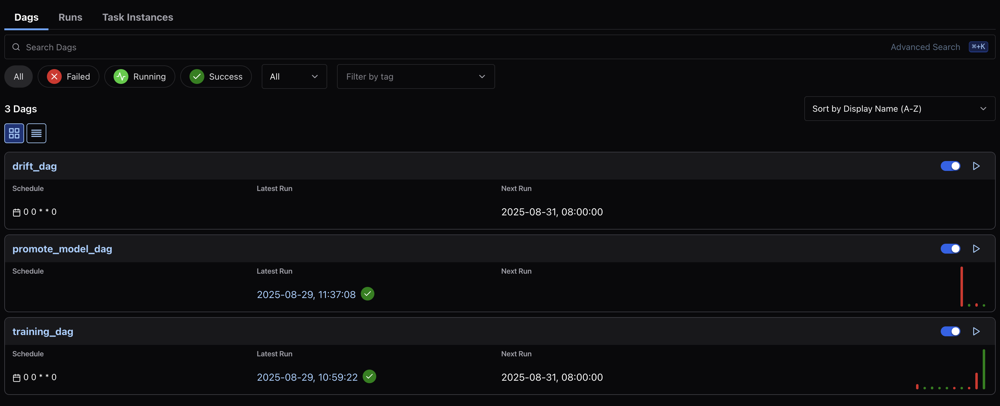
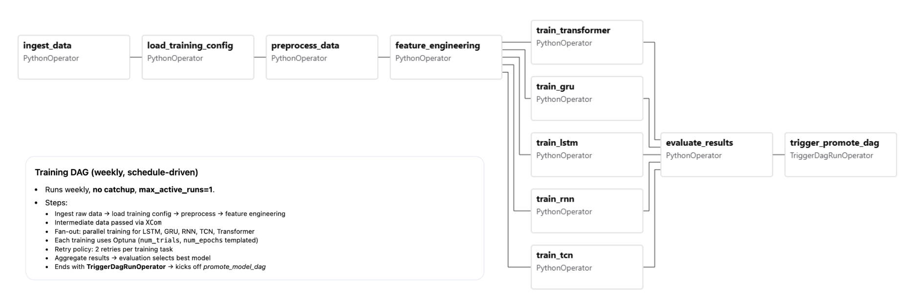
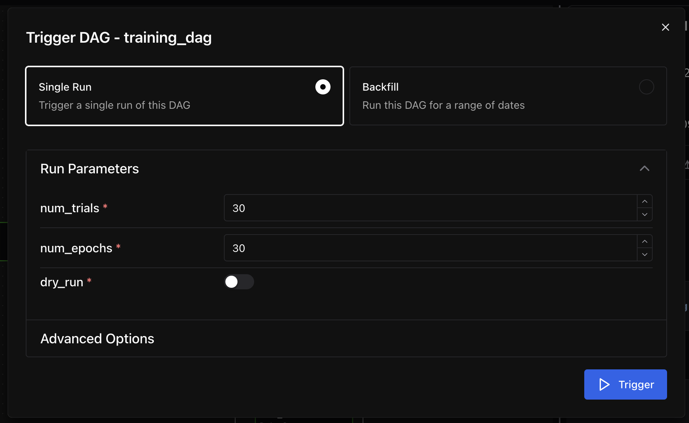

# Air Quality Index Probability Prediction (MLOps Version)

This repository is a modified version of the [original Air Quality Index (AQI) Probability Prediction project](https://github.com/PeteCastle/aqi-mdn), tailored for an activity as part of the requirements for Machine Learning Operations (MLOps) course.  Intellectual property rights for the original project are retained by the original authors: Francis Mark Cayco, Andgrel Heber Jison, Angela Elaine Pelayo, and Eros Paul Estante.

**Francis Mark Cayco**
**Angela Elaine Pelayo**
**Eros Paul Estante**

Masters of Science in Data Science

Asian Institute of Management

## Project Overview
*How can Mixture Density Networks improve air pollution forecasting by providing uncertainty-aware predictions that support more informed and reliable business or policy decisions?*

Traditional air quality forecasting models frequently provide deterministic, single-point predictions without quantifying the associated uncertainty. This limitation can be problematic, especially when decision-making requires an understanding of the range of possible outcomes. Recent studies have highlighted this issue. For instance, research has shown that most current data-driven air quality forecasting solutions lack proper quantifications of model uncertainty, which is crucial for communicating the confidence in forecasts. This gap underscores the need for models that can provide probabilistic forecasts, offering a distribution of possible outcomes rather than a single deterministic prediction.

Incorporating uncertainty quantification into air quality forecasts allows for better risk assessment and more informed decision-making. Probabilistic models, such as those using deep learning techniques, have been developed to address this need, providing more reliable uncertainty estimates and improving the practical applicability of air quality forecasts.

The goal of this project is to develop a probabilistic air quality forecasting model that captures a full range of possible pollutant concentrations, rather than relying on single-point predictions.  Use Mixture Density Networks (MDNs) to model predictive uncertainty.

Train and evaluate the MDN framework using various sequence modeling architectures:
- LSTM-MDN
- GRU-MDN
- Classic RNN-MDN
- TCN-MDN
- Transformer-MDN


## Data Sources
This project uses air quality index (AQI) data sourced from the **OpenWeatherMap API**, covering 138 cities globally from 2023 to 2025. For consistency and regional focus, we limit the scope to cities within Metro Manila, Philippines. The dataset contains hourly measurements of seven key air pollutants: **sulfur dioxide (SO₂), nitrogen dioxide (NO₂), particulate matter (PM10 and PM2.5), ozone (O₃), and carbon monoxide (CO)**. These pollutants are commonly monitored in environmental health studies and serve as the prediction targets for our probabilistic forecasting models.

Sources:
- [2023 to 2024 Data (Kaggle)](https://www.kaggle.com/datasets/bwandowando/philippine-major-cities-air-quality-data)
- [2025 Data (Kaggle)](https://www.kaggle.com/datasets/bwandowando/philippine-cities-air-quality-index-data-2025/data)

## Setup Instructions
> Notes for Methods 1 and 2:
> - CUDA GPU support in highly recommended for model training.
> - Apple Silicon MPS will never be supported in this Dockerized setup.

This method runs the entire pipeline using **Apache Airflow** in a Dockerized environment. It is the recommended way to orchestrate scheduled training, evaluation, and report generation.

#### 1. Install Docker Compose

Make sure you have the following installed:
- [Docker](https://docs.docker.com/get-docker/)
- [Docker Compose](https://docs.docker.com/compose/install/)
  (v2 preferred: `docker compose` instead of `docker-compose`)

To verify installation:
```bash
docker --version
docker compose version
```

#### 2. Clone the repository
Clone the repository to your local machine:
```bash
git clone https://github.com/PeteCastle/6bd14ff485084ce2fd9c18e9539cab76bc04816b587a434afc54c644bc3abdc7_aqi_probability_prediction aqi-probability-prediction
```

#### 3. Setup the Airflow environment variables
- Navigate to the project directory.
- Inside the `config` directory, create an `.env` file using `config/.env.example` as a reference.
- Inside the `config` directory, create an `airflow.cfg` file using `config/airflow.cfg.example` as a reference.
- Inside the `config` directory, create a `config.yaml` file using `config/config.yaml.example` as a reference.

#### 4. Build the services
Build all services defined in the Docker Compose file:
```bash
docker compose -f docker/docker-compose.yml build
```

#### 5. Start the Airflow services
Start the Airflow webserver, scheduler, and other services in detached mode:
```bash
docker compose -f docker/docker-compose.yml up -d
```

#### 6. Running the Pipeline
Access the Airflow web interface and DAGs at `http://localhost:8080/dags`.

Click on `training_dag` to view the DAG details.


Click on `Trigger` to run the pipeline manually

Modify parameters if you want to specify the number of trials, epochs, or in dry run.  The script will always generate a report after training and evaluation.

#### Other Pipelines
- `drift_dag`: Detects data drift using Evidently and generates a report.
- `promote_model_dag`: Promotes the best model to production based on evaluation metrics.

#### 7.  Test the Datasets
To test the datasets, you should create an environment first.
```bash
uv venv
source .venv/bin/activate

uv pip install -r pyproject.toml
```

Run the following command on the root directory:

```bash
pytest
```

## Exposed Ports
The following ports are exposed by the Docker Compose setup:
- Postgres → 5432:5432
- FastAPI → 8000:8000
- MLflow → 5000:5000
- Airflow Webserver → 8080:8080
- (Optional / commented out) Airflow Flower → 5556:5555

All other services (Redis, Airflow scheduler/triggerer/worker/dag-processor, optuna-init, airflow-init) run internally on the Docker network and do not expose host ports.
